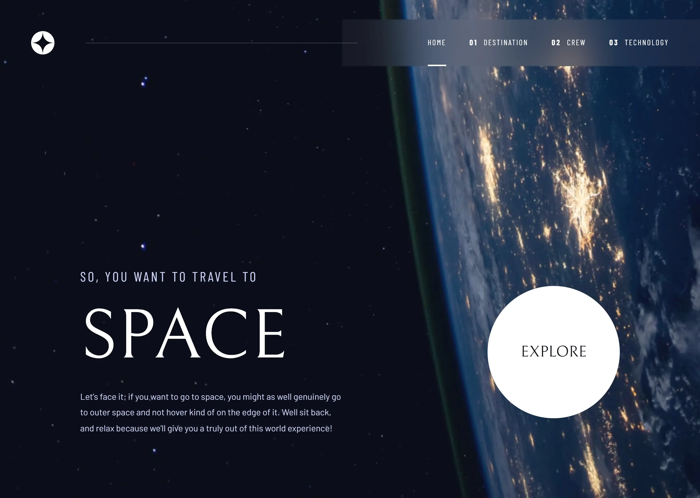
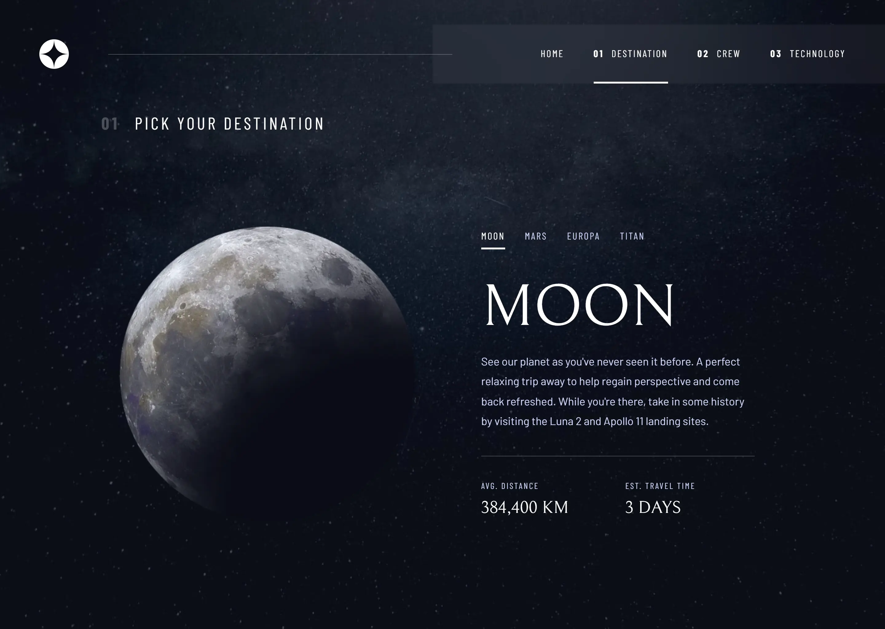
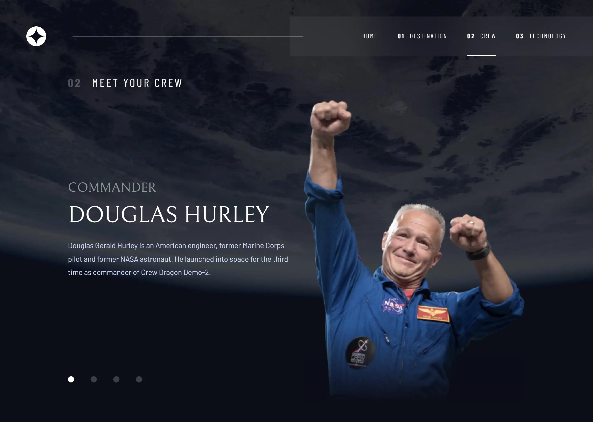
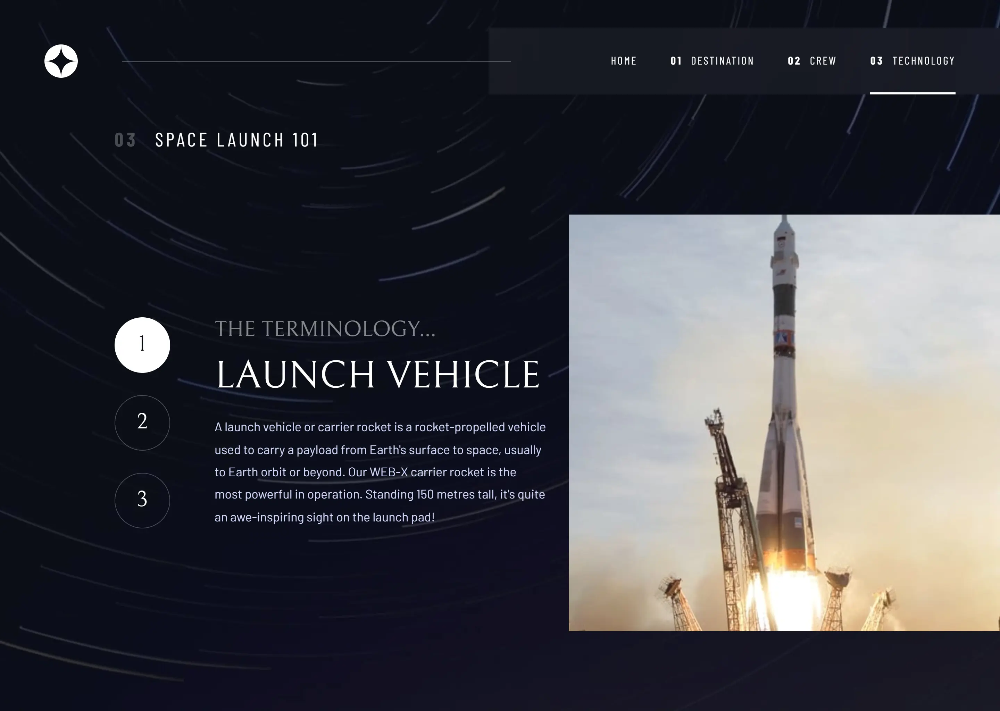

# Frontend Mentor - Space tourism website solution

This is a solution to the [Space tourism website challenge on Frontend Mentor](https://www.frontendmentor.io/challenges/space-tourism-multipage-website-gRWj1URZ3). Frontend Mentor challenges help you improve your coding skills by building realistic projects.

## Table of contents

- [Overview](#overview)
- [Built with](#built-with)
- [Author](#author)

## Overview

### The challenge

Users should be able to:

- View the optimal layout for each of the website's pages depending on their device's screen size
- See hover states for all interactive elements on the page
- View each page and be able to toggle between the tabs to see new information

### Screenshot

### Links

- Solution URL: [https://www.frontendmentor.io/solutions/space-tourism-website-solution-AYNx2GN-ha](https://www.frontendmentor.io/solutions/space-tourism-website-solution-AYNx2GN-ha)
- Live Site URL: [https://kerem-gurbuz-fm-space-tourism-website.vercel.app](https://kerem-gurbuz-fm-space-tourism-website.vercel.app)

## Built with

- Semantic HTML5 markup
- CSS custom properties
- Flexbox
- CSS Grid
- Mobile-first workflow
- [Next.js | TypeScript](https://nextjs.org/) - React framework
- [Tailwind CSS](https://tailwindcss.com/) - For styles
- [shadcn/ui](https://ui.shadcn.com/) - For UI components
- [useHooks.ts](https://usehooks-ts.com/) - For React hooks

## Author

- LinkedIn - [Kerem Gurbuz](https://www.linkedin.com/in/gurbuz-kerem)
- Frontend Mentor - [@kerem-gurbuz](https://www.frontendmentor.io/profile/kerem-gurbuz)
